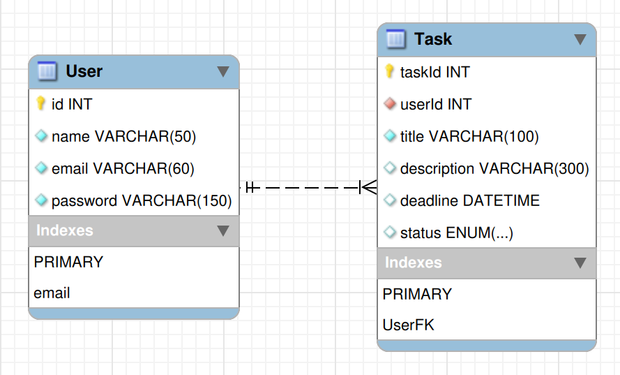

# Backend

O backend desta aplicação consiste em uma API Restful para o CRUD e login dos usuários e o CRUD das tarefas dos usuários, realizando a validação com as regras de negocio e persistência de dados utilizando Docker.

## Data Diagram

O diagrama de dados pode ser visto abaixo:

<div align="center">
    
</div>

Onde o usuário realizará o login com o email e a senha (que será encriptada).

## Pré-requisitos

### Versões utilizadas

| :----------: | :-------------: |
| Nodejs | X.X.X |
| Typescript | X.X.X |
| Docker | X.X.X |

### Scripts

É necessário permitir a execução do <a href="./scripts.sh">script</a> com:
```bash
chmod +x ./scripts.sh
```

Assim, é possível ver as opções de comandos executando:
```bash
./scripts.sh -h | --help
```

## Comandos (apenas backend)

### Build & Executar

Com o script configurado, para buildar a imagem e iniciar a aplicação, executa-se:
```bash
sudo ./scripts -b | --build
```

### Logs

Para ver os logs dos containers:
```bash
sudo ./scripts -l | --logs  --app | --db
```

### Terminal

Para acessar o terminal de um containers:
```bash
sudo ./scripts -t | --terminal --app | --db
```

### Encerrar

Para encerrar a aplicação:
```bash
sudo ./scripts -d | --down
```

### Limpar Docker

Para remover a imagem, containers, volume e network criadas, executa-se:
```bash
sudo ./scripts -r | --remove
```

## .env (opcional)

É possível utilizar um arquivo .env para a configuração de parâmetros como a porta em que a aplicação estará ativa, conexões com o banco de dados e o modo em que a aplicação esta rodando (dev || prod). Isto pode ser visto no arquivo <a href="./.env_sample">env_sample</a>.

O principal uso para o arquivo env é a configuração da porta.

Contudo, a aplicação tem valores padrões pré estabelecidos para o caso de ausência do .env.

## Endpoints

A API desenvolvida pode ser acessada pelo <a href="http://localhost">localhost</a> passando a porta padrão (8000) ou a configurada no .env.

### CRUD - Usuários

#### Create

```json
{
    "Método": "POST",
    "Url": "http://localhost:8000/..."
    "Body": {
        ...
    }
}
```

>> Concluir documentação dos endpoints quando concluir desenvolvimento.

<h6 align="center">by David Propato <a href="https://github.com/Propato">@Propato</a></h6>